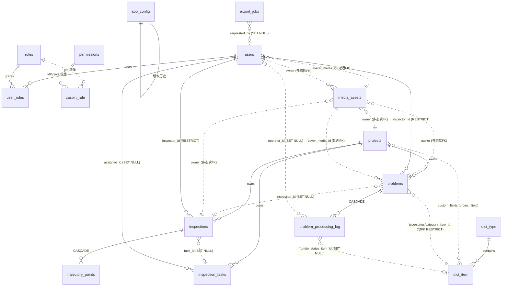

# C5 数据模型与 API / 同步契约（共享基础）

> 三端共享的契约。表名与接口名为权威命名，前后端 APP 均逐字引用。

## 一、ER 概览

16 张表，9 个原生枚举，全部 geometry 列 `CHECK(ST_SRID=4326)`。下图为实体关系概览（实线 = DB 外键；虚线 = 延迟外键 / 多态软外键 / 软外键）。



**关系要点：**
- **延迟外键（deferred FK）**：`users.avatar_media_id`、`problems.cover_media_id` → `media_assets`（创建顺序解耦，service 层补写）。
- **多态软外键**：`media_assets(owner_type, owner_id)`，`owner_type ∈ {problem|inspection|project|user}`，**无 DB 外键**，按 `(owner_type, owner_id)` btree 检索。
- **字典软外键**：`problems.{type|status|category}_item_id → dict_item`，`ON DELETE RESTRICT`（只允许 `is_active=false` 退役，禁止硬删），配合 `dict_version_used` 历史钉版。
- **RBAC 镜像**：`roles`/`permissions` 仅为 casbin `casbin_rule` 的人类可读镜像；强制点是 casbin。

## 二、数据字典

# C5 Data Dictionary

All geometry SRID 4326 (WGS84) — GCJ-02 is **never** persisted; convert only at the Tencent-map render boundary on the client. All timestamps are `timestamptz` (UTC; render Asia/Shanghai at the edge). Audit columns `created_by/updated_by/created_at/updated_at` and soft-delete `deleted_at` are present on the master tables. `updated_at` is auto-touched by the `set_updated_at()` BEFORE UPDATE trigger on every master table.

## 枚举字面量权威表（CANONICAL — 三端逐字引用）

下列原生枚举的字面量为**冻结值**，三端（00 契约 / 000002 seed / backend / web / app）必须逐字一致。字典类（`problem_type`/`problem_status`/`problem_category`）为**管理员可配置的 dict_item，不是 DB 枚举**。

| 枚举 | 归属列 | 字面量（精确顺序） | 说明 |
|------|--------|--------------------|------|
| `project_status` | `projects.status` | `ACTIVE` \| `PAUSED` \| `ARCHIVED` | 原生枚举。 |
| `task_status` | `inspection_tasks.status` | `PENDING` \| `IN_PROGRESS` \| `COMPLETED` \| `ARCHIVED` | 原生枚举。**禁止**使用旧的 `OPEN`/`DONE`（web 旧稿误用，须 remap `OPEN→PENDING`、`DONE→COMPLETED`）。 |
| `inspection_status` | `inspections.status` | `IN_PROGRESS` \| `FINISHED` \| `ABANDONED` | 会话状态。`/inspections/start` 后置 `IN_PROGRESS`；`/finish` 后置 `FINISHED`；丢弃置 `ABANDONED`。APP 本地 FSM `IDLE→STARTING→ACTIVE→ENDING→ENDED` 映射：`ACTIVE→IN_PROGRESS`、`ENDED→FINISHED`、丢弃→`ABANDONED`。 |
| `capture_state` | `media_assets.capture_state` | `CAPTURED_RAW` \| `STITCHED` \| `QUEUED` \| `UPLOADING` \| `UPLOADED` \| `CONFIRMED` | 单向前进；`verified_at` 仅在 `CONFIRMED`（backend HeadObject 通过后）写入。 |
| `media_tier` | `media_assets.tier` | `original` \| `web` \| `thumb` | 见 D4：APP 仅上传 `original`，backend worker 派生 `web`+`thumb`。 |
| `media_owner_type` | `media_assets.owner_type` | `problem` \| `inspection` \| `project` \| `user` | 多态软外键，无 DB 外键。 |
| `job_status` | `export_jobs.status` | `PENDING` \| `RUNNING` \| `SUCCEEDED` \| `FAILED` \| `CANCELLED` | `CANCELLED` 为 DB 枚举第 5 值，**可选**（取消能力可选暴露）；应用级核心集为前 4 个。 |
| `export_type` | `export_jobs.type` | `INSPECTION_RECORDS` \| `PROBLEM_LIST` \| `PROJECT_STATS` | **三种导出**，对应客户清单三-8（`PROJECT_STATS` = 项目统计数据Excel，易漏）。 |
| `dict_scope` | `dict_type.scope` | `problem_type` \| `problem_status` \| `problem_category` \| `project_field` \| `capture_preset` \| `misc` | 字典作用域。 |
| `problem_processing_log.action` | `problem_processing_log.action` | `STATUS_CHANGE` \| `COMMENT` \| `REASSIGN` | 仅追加审计。`STATUS_CHANGE` **仅 backend 生成**（见 D3）；客户端只 POST `COMMENT`/`REASSIGN`。 |

**字典类基线值（dict_item，非枚举）**：`problem_status` 作用域下 seed 基线 `OPEN`/`PROCESSING`/`RESOLVED`/`CLOSED`；退役用 `is_active=false`，**永不硬删**。客户端（web `DictTag`、app 字典缓存）**必须**渲染已退役项以兼容历史数据。`problem_type`/`problem_category` 同理由 000002 seed 提供基线。

> **seed 来源声明**：`db/migrations/000002_seed.up.sql` 是枚举初值 + casbin_rule + roles/permissions + 核心 dict_types + `app_config(export.image, capture.default)` 的**唯一权威来源**。该文件**已落盘并经 postgis:16-3.4 容器验证**（见第四节）；是后端 P2 鉴权与 P4 字典的 Day-1 前置（启动后须执行该迁移）。

## Identity & RBAC

### users
Inspector + admin accounts. **Key columns:** `username` (unique among non-deleted via `lower(username)` partial index), `password_hash` (bcrypt/argon2 — never plaintext), `display_name`, `is_active`, `last_login_at`, `avatar_media_id` (soft→`media_assets`, deferred FK). Soft-deleted via `deleted_at`.

### roles
UI catalog for casbin role subjects. **Key columns:** `code` (== casbin `sub`, e.g. `admin`, `inspector`), `name` (zh label), `is_system` (protect built-ins), `sort_order`.

### permissions
UI catalog labeling casbin object/action pairs for the admin permission tree. **Key columns:** `code` (e.g. `project:read`), `object` (resource, e.g. `/api/v1/projects`), `action` (e.g. `GET`), `group_name` (UI grouping). Pure label/metadata table; enforcement is casbin.

### user_roles
Many-to-many user↔role. PK `(user_id, role_id)`; both FKs `ON DELETE CASCADE`.

### casbin_rule
DB-backed casbin policy store (standard go-casbin adapter layout: `ptype,v0..v5`). Admin-editable, redis-watcher synced. `uq_casbin_rule` over all 7 columns prevents duplicate rules. **Notes:** `p` rows = policies, `g` rows = role groupings; `roles`/`permissions` are only human-friendly mirrors of `v0/v1/v2`.

## Dictionary / Config

### dict_type
A named admin-configurable catalog. **Key columns:** `code` (machine key, unique), `scope` (`problem_type|problem_status|problem_category|project_field|capture_preset|misc`), `version` (int, bumps when item set changes), `content_hash` (**= ETag** for dictionary pull), `is_active`. **Notes:** clients pull items with the type's `version`/`content_hash`; bump version on any item change.

### dict_item
A value within a `dict_type` (problem types/statuses/categories, capture presets). **Key columns:** `code` (unique within type among non-deleted), `label`, `color`, `extra` jsonb (e.g. capture preset width/quality), `sort_order`, `is_active`. **Notes — historical versions:** retiring an item sets `is_active=false` (NOT delete); problems referencing it via soft FK + `dict_version_used` remain valid. Ingest MUST accept items tagged with a since-retired type.

### app_config
Versioned key/value config blocks with full history. **Key columns:** `config_key`, `value` jsonb, `version`, `content_hash` (ETag), `is_active`, `effective_from/effective_to`. **Notes:** `uq_app_config_active` (partial `WHERE is_active`) enforces exactly one current version per key; `uq_app_config_key_version` keeps history integrity. Holds export image size/quality (`export.image`), capture defaults (`capture.default`), etc.

## Projects & Tasks

### projects
**Key columns:** `code` (unique among non-deleted), `name`, `status` (`project_status` enum), `custom_fields` jsonb (driven by `dict_scope='project_field'`), `area_geom` `geometry(MultiPolygon,4326)` with `CHECK(ST_SRID=4326)`, `start_date/end_date`. GiST on `area_geom`.

### inspection_tasks
Assignable work unit within a project. **Key columns:** `project_id` (FK RESTRICT), `title`, `status` (`task_status`), `assignee_id` (FK→users SET NULL), `planned_start/planned_end`, `plan_geom` `geometry(MultiLineString,4326)` + SRID CHECK. Btree on project/assignee/status; GiST on `plan_geom`.

## Inspections & Trajectory

### inspections
One "开始巡查→结束巡查" session. **Key columns:** `client_uuid` (UNIQUE — offline idempotency), `project_id` (RESTRICT), `task_id` (SET NULL), `inspector_id` (RESTRICT), `status` (`inspection_status`), `started_at`/`ended_at` (CHECK `ended_at >= started_at`), `duration_seconds`, `mileage_meters` **DOUBLE PRECISION computed via `ST_Length(route_geom::geography)` — geography gives meters; plain `geometry(4326)` would give degrees**, `point_count`, `route_geom` `geometry(LineString,4326)` (NULL until session end, built from trajectory points) + SRID CHECK. GiST on `route_geom`; btree on FKs + `status` + `started_at`.

### trajectory_points
High-volume raw GPS samples. **Key columns:** `client_uuid` (UNIQUE — idempotent batch upsert), `inspection_id` (FK CASCADE), `seq` (`UNIQUE(inspection_id,seq)` ordering integrity), `geom` `geometry(Point,4326) NOT NULL` + SRID CHECK, `recorded_at` (device fix time), `speed/bearing/altitude/accuracy`. GiST on `geom`; btree on `inspection_id` + `recorded_at`. **Notes:** no soft delete (purged with parent inspection).

## Problems & Processing

### problems
A 360-annotated issue. **Key columns:** `client_uuid` (UNIQUE — offline idempotency), `project_id` (RESTRICT), `inspection_id` (SET NULL), `inspector_id` (RESTRICT), `geom` `geometry(Point,4326) NOT NULL` + SRID CHECK (auto-located), `type_item_id`/`status_item_id`/`category_item_id` (**soft FK→dict_item, ON DELETE RESTRICT** so referenced items can't be hard-deleted, only retired), `dict_version_used` (pins problem_type dict version at capture), `description`/`note`, `captured_at`, `cover_media_id` (denormalized cover, deferred FK→media_assets). GiST on `geom`; btree on every FK + `captured_at`.

### problem_processing_log
Append-only event/audit trail. **Key columns:** `problem_id` (CASCADE), `action` (`STATUS_CHANGE|COMMENT|REASSIGN`), `from_status_item_id`/`to_status_item_id` (→dict_item SET NULL), `note`, `operator_id` (→users SET NULL), `created_at`. **Notes:** insert-only; no `updated_at`/soft-delete by design. **D3 原子性：** `STATUS_CHANGE` 行**仅由 backend 生成**——`PUT /problems/{id}` 改变 `status_item_id` 时在**同一事务**内追加一行 `STATUS_CHANGE`；客户端**永不**直接 POST `STATUS_CHANGE`（只 POST `COMMENT`/`REASSIGN`）。

## Media

### media_assets
COS-backed media, 3 tiers + capture state machine. **Key columns:** `client_uuid` (UNIQUE — idempotency), `owner_type`/`owner_id` (polymorphic soft FK; btree on the pair), `tier` (`original|web|thumb`), `cos_bucket`+`cos_key` (`UNIQUE(cos_bucket,cos_key)`, key lives under the per-upload STS prefix), `cos_region`, `content_type`, `byte_size`, `width`/`height` (equirectangular e.g. 4096×2048), `etag` (COS ETag to verify), `capture_state` (`CAPTURED_RAW→STITCHED→QUEUED→UPLOADING→UPLOADED→CONFIRMED`), `verified_at` (**set only after backend HeadObject-verifies the key**), `media_group` (uuid grouping original/web/thumb siblings), `meta` jsonb. Btree on `capture_state`/`tier`/`media_group`/`verified_at`. **D4 tier 归属：** APP **只**上传 `tier=original`（端上 equirectangular + GPano XMP）；`original` 到达 `CONFIRMED` 后由 backend asynq worker 派生 `tier=web` 与 `tier=thumb` 兄弟行（共享 `media_group`）。web 用 `web` 喂 PSV、用 `thumb` 喂列表/导航。

## Export

### export_jobs
Async Excel export jobs (asynq). **Key columns:** `job_uuid` (UNIQUE — public handle for SSE/poll), `type` (`INSPECTION_RECORDS|PROBLEM_LIST|PROJECT_STATS` — **三种导出**，对应客户清单三-8), `params` jsonb (project/time/inspector filters), `status` (`PENDING|RUNNING|SUCCEEDED|FAILED|CANCELLED`；`CANCELLED` 可选), `progress` (CHECK 0..100), `total_rows`/`processed_rows`, `result_cos_key`+`result_bucket` (produced .xlsx), `error`, `requested_by` (→users SET NULL), `started_at`/`finished_at`. Btree on `status`/`requested_by`/`created_at`.

## Idempotency key summary
`client_uuid` UNIQUE on: `inspections`, `trajectory_points`, `problems`, `media_assets`. Sync uses `INSERT ... ON CONFLICT (client_uuid) DO ...` with per-item savepoints.

## 三、API 与同步契约

# C5 API Contract (`/api/v1`)

Spec-first OpenAPI 3, served by Gin. The single `api/openapi.yaml` drives codegen: Go server stubs via **oapi-codegen v2**; web TS types/client via **openapi-typescript / openapi-generator**; Android Kotlin/Retrofit client via **openapi-generator** (`-g kotlin --library jvm-retrofit2`). NOTE: oapi-codegen is Go-only — it does NOT emit TS/Kotlin. **One concrete response schema per endpoint** (no loose `object`) so generated clients are fully typed.

## Response envelope
Every JSON response (success or error):
```json
{ "success": true, "data": <T|null>, "error": null, "meta": null }
{ "success": false, "data": null, "error": {"code":"VALIDATION_FAILED","message":"...","details":[...]}, "meta": null }
```
List endpoints set `meta`: `{ "total": 1234, "page": 1, "page_size": 20 }`. HTTP status mirrors envelope (200/201 success; 401/403/404/409/422/429/500 errors). Each endpoint declares a named schema, e.g. `ProblemListResponse` = envelope with `data: Problem[]` + `meta`.

## 错误码目录（CANONICAL — 三端唯一字面量）

`error.details[]` 元素形如 `{field, code, message}`。下表为**冻结**的错误码集合，backend 常量、web `apiError.ts`、app `AppError` 须逐字一致。

| `error.code` | HTTP | 触发场景 |
|--------------|------|----------|
| `VALIDATION_FAILED` | 422 | 边界 schema/业务校验失败（validator/v10、zod，几何 `ST_IsValid` 非法、`ended_at<started_at`、未知 custom_field key）。 |
| `UNAUTHENTICATED` | 401 | 缺失/无效 bearer access token。**注意**：旧稿用过 `UNAUTHORIZED`，统一改名为 `UNAUTHENTICATED`（唯一规范字面量）。 |
| `TOKEN_EXPIRED` | 401 | access JWT 过期（`exp` 已过）。与 `UNAUTHENTICATED` 区分，便于客户端触发 `/auth/refresh` single-flight。 |
| `FORBIDDEN` | 403 | casbin `(sub,obj,act)` 拒绝。前端权限仅控 UI，即使隐藏了控件也须处理此码。 |
| `NOT_FOUND` | 404 | 资源 id/handle 不存在或已软删（`deleted_at`）。 |
| `CONFLICT` | 409 | 唯一冲突（username/code/cos_key）、删除 RESTRICT（有巡查的项目）、`uq_app_config_active` 竞态、非法状态机迁移、同步中 `(inspection_id,seq)` 冲突。 |
| `MEDIA_VERIFY_FAILED` | 409 | `/media/confirm` HeadObject 不匹配（key 缺失或 etag/size 不符）；`capture_state` 维持 `UPLOADING`，客户端重试。 |
| `DICT_VERSION_RETIRED` | 409 | **保留/边缘**：字典操作显式拒绝退役版本。**注意**：携带退役 `type_item` + 旧 `dict_version_used` 的问题正常入库是**接受**而非拒绝（历史容忍），故此码**不用于**历史容忍同步。 |
| `RATE_LIMITED` | 429 | 应用层热点限流（login、sync/batch）。CLB/网关也可能 429。客户端须 backoff。 |
| `INTERNAL` | 500 | 未处理 panic/error；recover 中间件输出 `INTERNAL` 信封，**绝不**泄露 stack/SQL；详细上下文仅记服务端日志。 |

## Auth flow
- `POST /api/v1/auth/login` → `{access_token, refresh_token, expires_in, user}`. Access = short-lived JWT (golang-jwt/v5). Refresh = opaque token in Redis (revocable).
- `POST /api/v1/auth/refresh` → new access (rotates refresh).
- `POST /api/v1/auth/logout` → revokes refresh in Redis.
- `GET  /api/v1/auth/me` → current user + roles + effective permission codes (drives web dynamic menu + route guards).
- `PUT  /api/v1/auth/password` → change own password.
- Bearer access on all protected routes; **casbin** middleware checks `(sub=user roles, obj=path, act=method)`; 403 → `error.code="FORBIDDEN"`.

## REST resource map
```
# Identity / RBAC (admin)
GET/POST/PUT/DELETE   /api/v1/users               /users/{id}
GET                   /api/v1/roles               POST/PUT/DELETE /roles/{id}
GET                   /api/v1/permissions         # full permission catalog (UI tree)
GET/PUT               /api/v1/roles/{id}/permissions     # casbin p-rules for a role
GET/PUT               /api/v1/users/{id}/roles           # casbin g-rules for a user

# Dictionary / config (admin write, all read)
GET                   /api/v1/dict/types          GET /dict/types/{code}/items   # see ETag pull below
POST/PUT/DELETE       /api/v1/dict/types/{id}     /dict/items, /dict/items/{id}  # retire = is_active=false
GET/PUT               /api/v1/config/{key}        GET /config/{key}/history

# Projects & tasks
GET/POST/PUT/DELETE   /api/v1/projects            /projects/{id}
GET/POST/PUT/DELETE   /api/v1/tasks               /tasks/{id}     (?project_id=, ?status=, ?assignee_id=)

# Inspections & trajectory
GET                   /api/v1/inspections         (?project_id=&inspector_id=&from=&to=&status=)
GET                   /api/v1/inspections/{id}    GET /inspections/{id}/trajectory   # route + points (WGS84)
POST                  /api/v1/inspections/start   POST /inspections/{id}/finish      # finish computes mileage/duration

# Problems
GET/POST/PUT/DELETE   /api/v1/problems            /problems/{id}  (?project_id=&type=&status=&category=&from=&to=&inspector_id=&inspection_id=)   # D1: inspection_id 按巡查记录筛选
GET                   /api/v1/problems/{id}/logs  POST /problems/{id}/logs   # append COMMENT/REASSIGN only (D3: STATUS_CHANGE 由后端原子写)
GET                   /api/v1/problems/map        # GeoJSON FeatureCollection (WGS84) for map layer

# Media
POST                  /api/v1/media/upload-credentials   # STS (see below)
POST                  /api/v1/media/confirm              # HeadObject verify (see below)
GET                   /api/v1/media/{id}                 # signed CDN URL per tier

# Statistics & export
GET                   /api/v1/stats/overview      (?project_id=&from=&to=&inspector_id=)  # D2 extended shape, see below
POST                  /api/v1/exports             GET /exports/{job_uuid}   GET /exports/{job_uuid}/events (SSE)
```

### D1 — `/problems` 按巡查记录筛选
`/problems` 允许的查询参数 = `{project_id, type, status, category, from, to, inspector_id, inspection_id}`。`inspection_id` 让 web「巡查详情 → 该次巡查的问题列表」与 APP「按巡查同步问题」均成立。须落到 OpenAPI operation params + backend handler + sqlc WHERE 子句。

### D2 — `/stats/overview` 响应 schema（单一来源，同时支撑 web P7 仪表盘与 PROJECT_STATS 导出）
过滤参数：`project_id` + `from` + `to` + `inspector_id`。响应 `data` 形如：
```json
{
  "counts_by_type":      [{"item_id":1,"label":"路面破损","color":"#e11","count":42}],
  "counts_by_status":    [{"item_id":7,"label":"待处理","color":"#888","count":15}],
  "counts_by_inspector": [{"inspector_id":3,"label":"张三","count":28}],
  "counts_by_project":   [{"project_id":9,"label":"某路段","count":33}],
  "inspection_count": 120,
  "problem_count": 88,
  "total_mileage_meters": 152340.5,
  "total_duration_seconds": 86400,
  "avg_duration_seconds": 720.0
}
```
- 每个数组元素 = `{item_id|inspector_id|project_id, label, count}`；`counts_by_type`/`counts_by_status` 使用 dict_item 的 `label`+`color`，**含已退役项**（历史数据可读）。
- `total_mileage_meters` = `SUM(inspections.mileage_meters)`（米，后端聚合）；duration 聚合来自 `inspections.duration_seconds`。
- `PROJECT_STATS` 导出复用本聚合逻辑（按 project 维度）。

### D3 — 问题状态变更日志原子性
`PUT /problems/{id}` 若改变 `status_item_id`，则在**同一 DB 事务**内自动追加一行 `problem_processing_log(action='STATUS_CHANGE', from/to_status_item_id, operator_id)`。客户端**永不**单独 POST `STATUS_CHANGE`；`POST /problems/{id}/logs` 仅接受 `COMMENT`/`REASSIGN`。状态变更 = 一次 PUT，日志自动出现。

## Offline-sync batch upsert contract
`POST /api/v1/sync/batch` — single idempotent envelope carrying inspections, trajectory points, problems, and media references created offline.
- Each item carries its **client-generated `client_uuid`**. Server runs `INSERT ... ON CONFLICT (client_uuid) DO UPDATE/NOTHING` inside a **per-item SAVEPOINT** so one bad item never aborts the batch.
- Response: `data.results: [{client_uuid, status: "accepted"|"rejected"|"duplicate", server_id?, error?}]` — **per-item accept/reject**. `duplicate` = already ingested (idempotent replay), still returns `server_id`.
- Trajectory points upsert keyed on `client_uuid`; `(inspection_id, seq)` uniqueness rejects reordered dupes per item.
- **Capture state machine** drives media items: client reports `CAPTURED_RAW→STITCHED→QUEUED`; the binary itself NEVER travels in this JSON (see STS flow). On `confirm`, server advances `UPLOADED→CONFIRMED` and sets `verified_at`.
- **Historical dictionary tolerance:** items tagged with a now-retired `type_item` + older `dict_version_used` are accepted, not rejected.

## STS upload-credential + HeadObject verify flow
Large media never goes through the JSON API. Resumable multipart requires STS (presigned URLs cannot resume).
1. `POST /api/v1/media/upload-credentials` body `{owner_type, owner_id, tier, content_type, byte_size, client_uuid}` → `{bucket, region, key, credentials:{tmpSecretId,tmpSecretKey,sessionToken,expiredTime}, prefix}`. STS policy is **scoped to the per-upload `prefix`** and only the **6 multipart actions** (`InitiateMultipartUpload, UploadPart, CompleteMultipartUpload, AbortMultipartUpload, ListMultipartUploads, ListParts`).
2. Client multipart-uploads directly to COS using those temp creds (resumable).
3. `POST /api/v1/media/confirm` body `{client_uuid, key, etag, byte_size, width, height}` → backend **HeadObject-verifies** the key exists and ETag/size match BEFORE persisting the reference; on success sets `media_assets.capture_state='CONFIRMED'`, `verified_at=now()`. Mismatch → 409 `error.code="MEDIA_VERIFY_FAILED"`, state stays `UPLOADING`.

### D4 — 媒体分层归属（APP=original，backend 派生 web/thumb）
- APP **只**上传 `tier=original`（端上 `ExportUtils` PANORAMA equirectangular，尺寸/质量取 `app_config.export.image`，内嵌 GPano XMP）。
- `original` 到达 `CONFIRMED` 后，backend 触发一个 asynq worker 任务（约定名 `derive-media-tiers`）派生 `tier=web` 与 `tier=thumb` 兄弟 `media_assets` 行，**共享同一 `media_group`**。
- web 读 `tier=web` 喂 Photo Sphere Viewer，读 `tier=thumb` 喂列表/导航缩略图。APP 永不上传 `web`/`thumb`。

### D5 — GPano XMP 元数据（保证 web PSV 渲染为球面）
APP 优先采用 Insta360 `ExportUtils` 已内嵌的全景元数据；若缺失，则由 `:sdk-camera` 的 `XmpWriter` 写入 GPano XMP APP1 包，**精确 8 字段**：

| 字段 | 值 |
|------|----|
| `ProjectionType` | `equirectangular` |
| `UsePanoramaViewer` | `True` |
| `FullPanoWidthPixels` | `W` |
| `FullPanoHeightPixels` | `H` |
| `CroppedAreaImageWidthPixels` | `W` |
| `CroppedAreaImageHeightPixels` | `H` |
| `CroppedAreaLeftPixels` | `0` |
| `CroppedAreaTopPixels` | `0` |

DoD = `exiftool` 显示 `XMP-GPano:*` 标签 **且** web PSV 渲染为球面。说明：PSV equirectangular adapter 并不强依赖 GPano（仅凭 2:1 即可），但 APP 仍**必须**内嵌以保证健壮性/互操作。backend 仅存 `width`/`height`，不解析 XMP。

## Dictionary pull-with-version (ETag)
- `GET /api/v1/dict/types/{code}/items` returns items + sets `ETag: "<dict_type.content_hash>"`.
- Clients send `If-None-Match: "<hash>"`; server returns **304 Not Modified** when unchanged, else 200 + new body + new ETag. Response body includes `version` + `content_hash` so offline clients can pin `dict_version_used`.
- `GET /api/v1/config/{key}` follows the same ETag-on-`content_hash` pattern.

## Export 类型契约（三种 Excel — 对应客户清单三-8）
`POST /api/v1/exports` body `{type, params}`，`type ∈ INSPECTION_RECORDS | PROBLEM_LIST | PROJECT_STATS`：

| `type` | 内容 | `params` |
|--------|------|----------|
| `INSPECTION_RECORDS` | 巡查记录Excel。行 = inspections join project/inspector，含 `started_at/ended_at`(Asia/Shanghai)、`duration_seconds`、`mileage_meters`(→km)、`point_count`、`status`。 | `{project_id, inspector_id, from, to, status}`（同列表筛选）。 |
| `PROBLEM_LIST` | 问题列表Excel。行 = problems，含 type/status/category dict label（含退役）、project、inspector、`captured_at`(Asia/Shanghai)、description/note。 | `{project_id, type, status, category, from, to, inspector_id, inspection_id}`。 |
| `PROJECT_STATS` | **项目统计数据Excel**（客户清单三-8 易漏的第 3 种）。行 = 按项目聚合：`inspection_count`、`problem_count`、`counts_by_type`、`counts_by_status`、`total_mileage_meters`、`total_duration_seconds`、`avg_duration_seconds`。**复用 D2 `/stats/overview` 聚合逻辑**（worker 内 excelize 单独 sheet）。 | `{project_id?, from, to, inspector_id?}`。 |

> `PROJECT_STATS` 须落到 `export_type` 枚举（00 + 000002 seed）、backend worker 第 3 个 excelize sheet builder、web `ExportButton`（统计页 P7 + 项目列表）。

## SSE + poll job-progress contract
OpenAPI cannot express SSE, so it is hand-written with a polling fallback (Tencent CLB/CDN may buffer SSE).
- `POST /api/v1/exports` → `201 {job_uuid, status:"PENDING"}`.
- **SSE:** `GET /api/v1/exports/{job_uuid}/events` (`text/event-stream`) emits `event: progress` `data:{progress,processed_rows,total_rows,status}` and a terminal `event: done` `data:{status:"SUCCEEDED"|"FAILED", result_url?, error?}`.
- **Poll fallback:** `GET /api/v1/exports/{job_uuid}` returns the same job object; clients poll every ~2s if SSE drops. On `SUCCEEDED`, `result_url` is a signed CDN URL to the `.xlsx` at `result_cos_key`. `CANCELLED` 为可选取消结果。

## 四、设计说明 / 备注

VALIDATION (done, not claimed): ran the up migration on a real `postgis/postgis:16-3.4` container (PostGIS 3.4.3). Sequence: up → up-again (idempotent, exit 0) → down (exit 0, only PostGIS system objects remain, 0 custom enums) → up-again (exit 0, 16 tables). Functional smoke tests all passed: SRID 3857 insert rejected on trajectory geom; valid 4326 accepted; `UNIQUE(inspection_id,seq)` rejects dup seq; mileage via `ST_Length(line::geography)` returned 1025.2 m for ~0.01° lon at 23°N (meters, NOT degrees — confirms the geography cast requirement); `ON CONFLICT (client_uuid) DO NOTHING` idempotent (2nd insert = 0 rows); `app_config` single-active partial-unique enforced; `media_assets (cos_bucket,cos_key)` unique enforced; 5 GiST geometry indexes confirmed; both deferred media FKs and all four `client_uuid` uniques present; `ST_IsValid` available for ingest validation. Container removed after testing.

FILES WRITTEN (verbatim, the doc-writers should reference these) — **已落盘并实测验证**：
- /Users/nanako/Dropbox/SProject/C5/db/migrations/000001_init.up.sql
- /Users/nanako/Dropbox/SProject/C5/db/migrations/000001_init.down.sql
These are golang-migrate-compatible (numbered `NNNNNN_name.up.sql` / `.down.sql`).

> ✅ **枚举已校准（2026-06-26 完成）— 000001 现与本契约权威枚举表一致**：`000001_init.up.sql` 的 3 处初版字面量已就地改为权威值（绿地、迁移未上线，直接改 `CREATE TYPE` + `inspection_tasks.status` 默认值 `'OPEN'→'PENDING'`；`.down.sql` 用 `DROP TYPE` 无值列表故无需改动；`job_status` 自带的 `CANCELLED` 未动）：
> | 枚举 | 原初版 | 现值（已落盘） |
> |---|---|---|
> | `task_status` | ~~`OPEN, IN_PROGRESS, DONE, ARCHIVED`~~ | `PENDING, IN_PROGRESS, COMPLETED, ARCHIVED` |
> | `inspection_status` | ~~`PLANNED, IN_PROGRESS, FINISHED, CANCELLED`~~ | `IN_PROGRESS, FINISHED, ABANDONED` |
> | `export_type` | ~~`INSPECTION_RECORDS, PROBLEM_LIST`~~ | `INSPECTION_RECORDS, PROBLEM_LIST, PROJECT_STATS` |
>
> 其余 6 个原生枚举（`project_status / capture_state / media_tier / media_owner_type / job_status / dict_scope`）本就一致。`problem_type/problem_status/problem_category` 为 `dict_item`（非 DB 枚举），其基线值由下方 `000002_seed` 定义。

Day-1 关键契约产物（**均已落盘并验证**；启动后须冻结/执行）：
- `/Users/nanako/Dropbox/SProject/C5/api/openapi.yaml` — **已落盘**（OpenAPI 3.0.3，41 路径/113 schema，Redocly lint 通过，并经 oapi-codegen v2 → `go build` 验证）。三端客户端代码生成的**单一来源**：后端 Go stubs 用 **oapi-codegen v2**；网页 TS 用 **openapi-typescript/openapi-generator**；安卓 Kotlin/Retrofit 用 **openapi-generator**（oapi-codegen 仅生成 Go）。**冻结此文件 = 解锁 web/app 开发**。已含全部枚举字面量、错误码、`/problems` 的 `inspection_id` 参数（D1）、`/stats/overview` 扩展 schema（D2）、`export_type` 三值（含 `PROJECT_STATS`）。
- `/Users/nanako/Dropbox/SProject/C5/db/migrations/000002_seed.up.sql`（及 `.down.sql`）— **已落盘并经容器验证**。枚举/字典初值 + casbin_rule + roles/permissions（37 条权限码）+ admin 用户（**密码 LOCKED 落盘哨兵 `'!'`，无默认凭据**；部署时经 `c5-api create-admin` 读 `C5_BOOTSTRAP_ADMIN_PASSWORD` 设置）+ 核心 dict_types（problem_type/problem_status/problem_category，含 `problem_status` 基线 `OPEN/PROCESSING/RESOLVED/CLOSED`）+ `app_config(export.image, capture.default)`。幂等（`ON CONFLICT`），与 000001 分离以保持 schema 迁移无数据；后端启动后须执行。

KEY DESIGN DECISIONS the three dev docs must honor:
1. Geometry types: trajectory & problems use Point; inspections.route_geom is LineString (not MultiPoint) so `ST_Length(::geography)` works directly for mileage. tasks.plan_geom is MultiLineString; projects.area_geom is MultiPolygon. The task brief allowed "MultiPoint or LineString" for the route — I chose LineString because mileage is computed off it; the raw points live in trajectory_points.
2. Problem type/status/category are SOFT FKs to dict_item with ON DELETE RESTRICT (referenced items can be retired via is_active=false but not hard-deleted), plus dict_version_used pin → satisfies "ingest must accept historical dictionary versions." This is the only safe way to keep typed clients while honoring admin-editable + historical-tolerant dictionaries.
3. Capture state machine lives ONLY on media_assets.capture_state (CAPTURED_RAW→STITCHED→QUEUED→UPLOADING→UPLOADED→CONFIRMED). verified_at is set strictly after backend HeadObject verification. Media binaries never traverse the JSON API; STS creds scoped to per-upload prefix + the 6 multipart actions.
4. casbin_rule is the enforced policy source of truth; roles/permissions tables are UI-label catalogs (admin permission tree / dynamic menu) that mirror casbin g/p rules. Keep them in sync in the service layer.
5. Coordinates stored WGS84/4326 everywhere with CHECK(ST_SRID=4326) on every geom column (typmod also enforces it — belt and suspenders). GCJ-02 conversion is a client-only render-boundary concern; the API emits/accepts WGS84 (GeoJSON on /problems/map and /inspections/{id}/trajectory).
6. updated_at is trigger-maintained (set_updated_at()); services should not set it manually. created_by/updated_by are plain BIGINT (no FK) to avoid lock contention and to tolerate system/seed actors.

OPS / DAY-1 (carry into deployment docs): ICP备案 for the mainland domain; export worker image needs Noto Sans CJK + tzdata (excelize CJK font on cells); all timestamptz UTC, render Asia/Shanghai; seed casbin_rule + roles/permissions + the core dict_types (problem_type/problem_status/problem_category) + app_config (export.image, capture.default) via a separate seed migration (000002) — intentionally NOT included here so the schema migration stays data-free.

OPEN ITEMS for downstream docs (not blocking): (a) consider monthly RANGE partitioning of trajectory_points if volume is high — current single-table design with btree(inspection_id)+btree(recorded_at) is fine for moderate scale; (b) a periodic job to advance any media stuck in UPLOADING past TTL back to QUEUED for retry; (c) optional materialized view for stats/overview if ECharts dashboards get heavy.

## 五、需要确认问题 — 解决结论表（客户清单五，已冻结）

| # | 待确认项 | 结论 |
|---|----------|------|
| 五-1 | Insta360 SDK 能力（连接/控制拍照/取图/取全景文件/指定型号） | **已定**：Insta360 SDK **v1.10.1**，机型 **X3**，**仅照片（PHOTOS-ONLY）**。流程 = `openCamera(WIFI)` → `setNetIdToCamera` → `switchPanoramaSensorMode` → `startNormalCapture(gpsBytes)`/`startHDRCapture` → `WorkUtils.getAllCameraWorks` → `.insp` 下载（socket 绑定）→ `ExportUtils.exportImage(PANORAMA, 2:1)`。X3 **跳过** `initCameraSupportConfig`（X4+ 才需）。 |
| 五-2 | 是否需要实时预览 360 画面 | **已定：v1 不做实时预览**（仅拍照，降低难度）。APP 禁用全部 record/live 分支。拍后本地 `InstaImagePlayerView` 回看**不属于**实时预览。 |
| 五-3 | 地图服务 高德/百度/腾讯 | **已定：腾讯地图**（Web JS API GL + Android SDK）。GCJ-02 仅在渲染边界转换，WGS84 持久化；每端单一 `coordTransform`/`:core:geo` 转换器 + 单测。 |
| 五-4 | 是否需要离线巡查 | **已定：是，离线优先**。APP = Room outbox + WorkManager + `client_uuid` 幂等 + STS/COS 可断点续传 multipart + `/sync/batch` 逐项 SAVEPOINT。web 不调用 `/sync/batch`（纯消费者）。 |
| 五-5 | 网页端是否需要 360 全景拖动查看 | **已定：是，完整交互球面**（Photo Sphere Viewer v5），非平面预览。APP 用原生 `InstaImagePlayerView`；两端共享同一 equirectangular + GPano（见 D5）。 |

## 六、MVP 范围标注（客户清单四 — 简化版先行）

四MVP 子集映射到具体阶段（其余为后续增强；实时预览/录像/HDR-only 流程**完全不在 v1 范围**）：

- **APP（P1–P6 交付 MVP）**：
  - 用户登录 → **P1**
  - 项目列表 / 创建巡查任务 / 开始巡查 / 结束巡查 → **P2**
  - 连接影石360相机 / 调用相机拍照 → **P3**
  - GPS 轨迹记录 → **P4**
  - 填写问题描述 / 自动记录问题坐标 → **P5**
  - 上传照片轨迹问题数据（离线 outbox） → **P6**
  - （P0 脚手架/网络分离为使能项，非清单功能；P7 地图富化/上架打磨超出严格 MVP）
- **WEB（P0/P3/P4/P5/P6/P7/P8 交付 MVP；P1 字典配置、P2 RBAC 为横切使能项，保持轻量）**：
  - 后台登录 → **P0**（+ P2 鉴权）
  - 项目管理 → **P3**
  - 巡查记录查看 → **P3**
  - 地图查看巡查轨迹 / 问题点位 → **P4**
  - 查看问题照片 → **P5**
  - 问题列表管理 → **P6**
  - 数据统计 → **P7**
  - Excel 导出 → **P8**（**MVP 导出含全部三种**：`INSPECTION_RECORDS` + `PROBLEM_LIST` + `PROJECT_STATS`，因 `数据导出` 在 MVP 网页清单内）

## 七、需求追溯表（客户功能清单 → 交付阶段/任务）

每条客户清单叶子功能映射到落地的端/阶段。`covered` = 已被某端阶段承接；本契约负责定义其共享数据模型与 API。

| 客户清单条目 | 端 | 交付阶段/任务 | 本契约支撑点 |
|--------------|----|--------------|--------------|
| APP-1 用户登录（账号密码/用户信息/退出） | APP | P1 | `/auth/login` `/auth/me` `/auth/logout` `/auth/password` |
| APP-2 项目/巡查任务（列表/新建/详情/开始/结束） | APP | P2 | `/projects` `/tasks` `/inspections/start` `/inspections/{id}/finish` |
| APP-3 影石360对接（SDK/连接/状态/拍照/取全景/缓存/上传） | APP | P3 + P6 | `media/upload-credentials` STS + `media/confirm`；`capture_state` 状态机；D5 GPano |
| APP-4 巡查轨迹（GPS/起止时间/路线/当前位置/结束后上传） | APP | P4 + P6 | `trajectory_points`(client_uuid)；`/sync/batch`；`route_geom`/`mileage_meters` |
| APP-5 问题拍照标注（发现/360拍/自动定位/点位/描述/类型/坐标/备注） | APP | P5 | `problems`(geom 4326, type/category dict)；D1 inspection_id |
| APP-6 地图展示（当前位置/轨迹/问题点/详情/全景/描述备注） | APP | P7 | `/problems/map` GeoJSON；`/inspections/{id}/trajectory`；media web tier |
| APP-7 数据同步（照片/轨迹/问题/异常暂存/恢复重传） | APP | P6 | `/sync/batch` 逐项 SAVEPOINT；`client_uuid` 幂等；STS 续传 |
| WEB-1 后台登录（管理员/权限管理/改密/退出） | WEB | P0 + P2 | `/auth/*`；casbin `/users` `/roles` `/permissions` |
| WEB-2 项目管理（新建/编辑/删除/详情/列表） | WEB | P3 | `/projects` CRUD（RESTRICT 删除） |
| WEB-3 巡查记录管理（记录/人员/时间/轨迹/时长/里程） | WEB | P3 + P4 | `inspections`(`duration_seconds`/`mileage_meters`/`point_count`) |
| WEB-4 地图轨迹展示（路线/问题标注/详情/照片/巡查记录） | WEB | P4 | `/problems/map` + `/inspections/{id}/trajectory`（WGS84） |
| WEB-5 问题管理（列表/详情/分类/状态/备注/处理记录/按项目时间筛选） | WEB | P6 | `/problems`(D1 含 inspection_id)；`/problems/{id}/logs`（D3 原子 STATUS_CHANGE） |
| WEB-6 全景照片查看（360/预览/关联问题点位/巡查/项目） | WEB | P5 | media `tier=web`(PSV)/`thumb`；多态 owner |
| WEB-7 数据统计（巡查次数/问题数/类型/按项目时间人员） | WEB | P7 | D2 `/stats/overview` 扩展 schema |
| WEB-8 导出巡查记录Excel | WEB | P8 | `export_type=INSPECTION_RECORDS` |
| WEB-8 导出问题列表Excel | WEB | P8 | `export_type=PROBLEM_LIST` |
| WEB-8 导出项目统计数据Excel | WEB | P8 | `export_type=PROJECT_STATS`（复用 D2 聚合） |
| 横切 字典/配置（problem_type/status/category/project_field/capture_preset 可配置） | WEB | P1 | `dict_type`/`dict_item` + ETag 拉取（content_hash/304）+ 历史容忍 |
| 横切 媒体 web/thumb 派生（D4） | APP+BACKEND | APP P3 + backend worker | `derive-media-tiers` 任务；共享 `media_group` |
